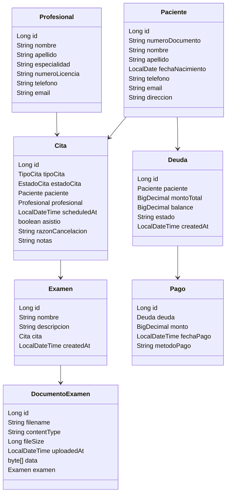
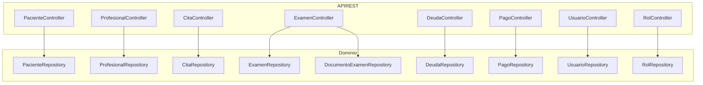
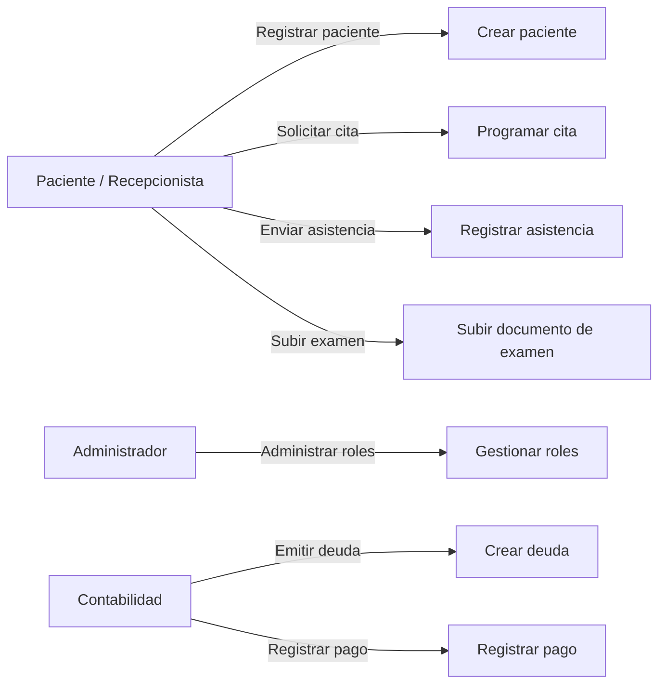
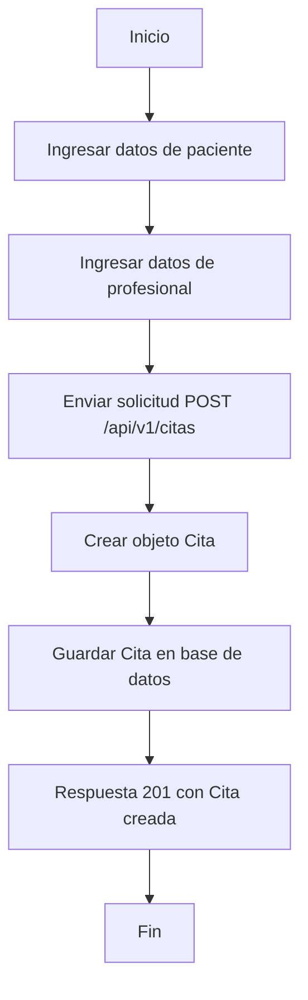
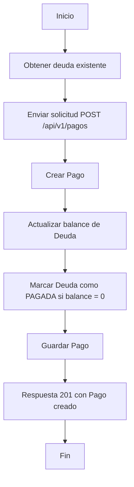
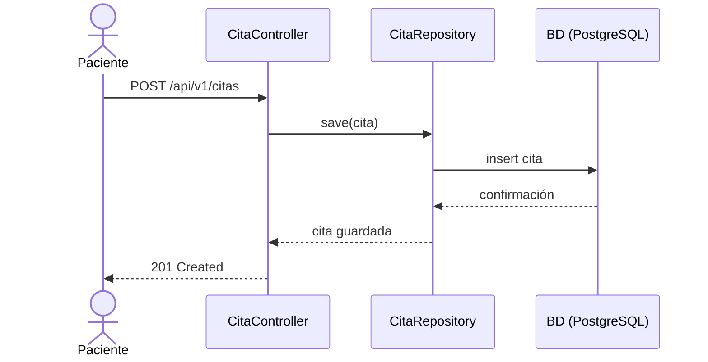
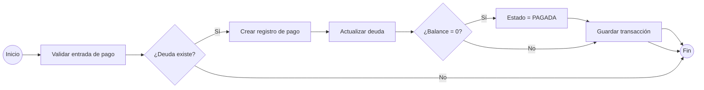

# Documentación del proyecto Clinik

## 1. Visión general

Clinik es un microservicio REST de gestión clínica con nombres y rutas en español.
La aplicación incluye los siguientes dominios principales:

- Pacientes (`Paciente`, `PacienteController`)
- Profesionales (`Profesional`, `ProfesionalController`)
- Citas (`Cita`, `CitaController`)
- Exámenes (`Examen`, `ExamenController`)
- Documentos de examen (`DocumentoExamen`)
- Deudas (`Deuda`, `DeudaController`)
- Pagos (`Pago`, `PagoController`)
- Roles y usuarios (`Rol`, `Usuario`)

## 2. Diagrama de clases

## 3. Diagrama de componentes

## 4. Diagrama de casos de uso

## 5. Diagrama de actividad: flujo de creación de cita

## 6. Diagrama de actividad: pago de deuda

## 7. Diagrama de secuencia: programación de cita

## 8. Diagrama BPMN: flujo de validación y pago

## 9. Notas de documentación

- Las rutas REST se exponen en español bajo `/api/v1/`.
- Las clases y entidades principales están localizadas en español para reflejar el dominio clínico.
- El esquema de datos usa `numeroDocumento`, `fechaNacimiento`, `montoTotal`, `metodoPago`, `documentos`, `ordenes-medicas` y `bitacoras`.
