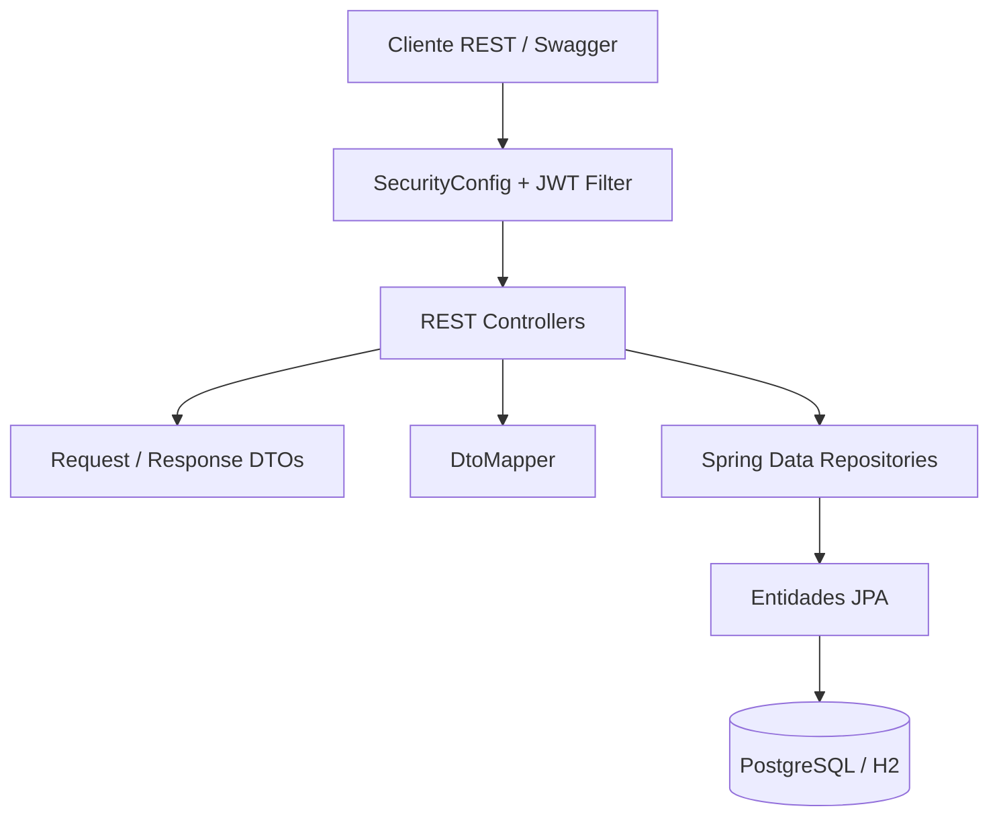
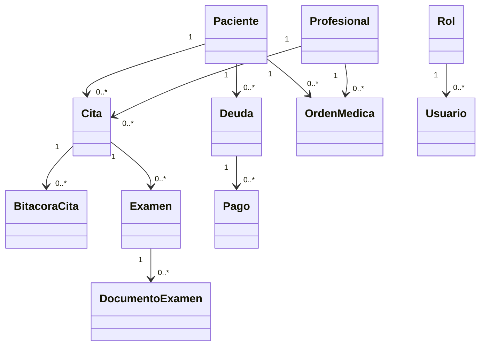
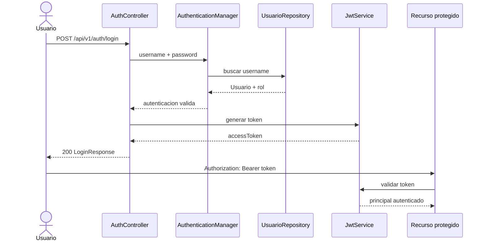
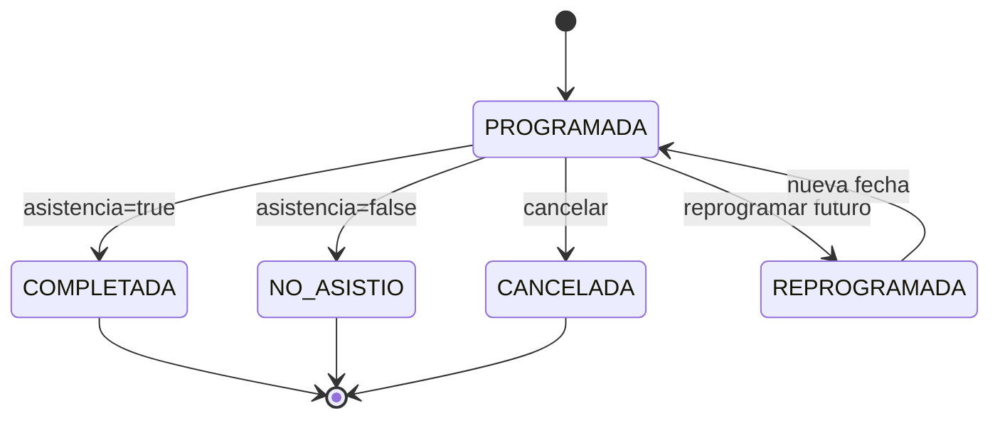
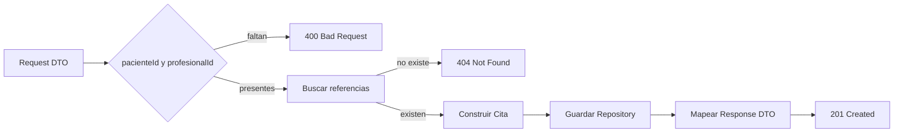
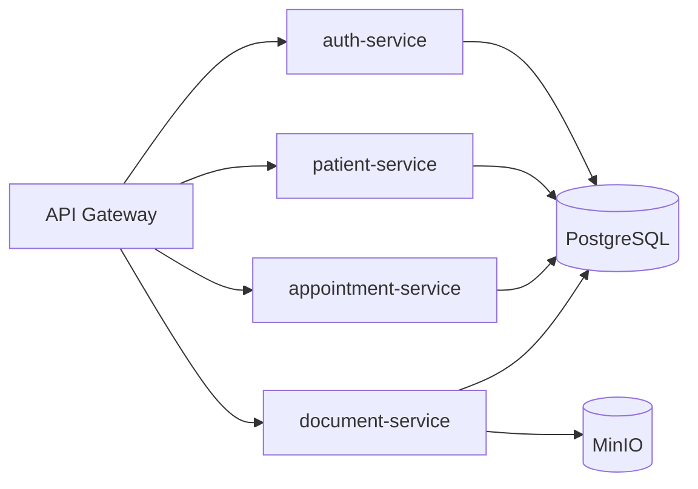

# Diagramas tecnicos

## Arquitectura actual

## Modulos del dominio

## Autenticacion

## Programacion y ciclo de cita

## Creacion de cita

## Alcance futuro

El ultimo diagrama representa la arquitectura objetivo del roadmap, no servicios actualmente desplegados en este repositorio.
